# Aplicativo de Lista de Tarefas com Django 


Este é um aplicativo simples de Lista de Tarefas construído usando o framework web Django e a biblioteca htmx para uma interação dinâmica entre cliente e servidor. O aplicativo permite aos usuários gerenciar suas tarefas de forma dinâmica, sem a necessidade de código JavaScript complexo.

## Teste o código usando esse link.
https://web-wine-iota.vercel.app/
* Hospedagem de aplicação na **Vercel** e banco de dados **ElephantSQL**.
* Para instação na sua maquina via LocalHost siga o Tutorial abaixo.

## Preparando o Ambiente e Rodando o Aplicativo
Siga as instruções abaixo para configurar o ambiente e executar o aplicativo Lista de Tarefas em sua máquina local.

## Pré-requisitos
Certifique-se de ter os seguintes pré-requisitos instalados em sua máquina:

- Python (versão 3.6 ou superior)
- pip (gerenciador de pacotes do Python)

- Compreensão básica de Python e do Framework Django.
- Familiaridade com o Django e seus conceitos.
[Nota: Use um ambiente virtual para a melhor prática. 👍]

## Passos
### 1. Instalação do Python
Baixe o instalador do Python para Windows no site oficial: Python Downloads.
Execute o instalador e certifique-se de marcar a opção "Add Python to PATH" durante a instalação.
Clique em "Install Now" para iniciar a instalação.

### 2. Instalação do pip
O pip é o gerenciador de pacotes do Python e geralmente é instalado automaticamente com o Python. Para verificar se você o tem instalado, execute:
``` python
pip --version
```
### 3. Instalação do Django
Com o Python e o pip instalados, você pode instalar o Django usando o seguinte comando:
``` python
pip install django
```
Certifique-se de verificar a versão do Django instalada:
``` python
django-admin --version
```
## Configurando o Ambiente e Executando o Aplicativo
1. Clone o Repositório:
   
```
git clone <https://github.com/stephenbarreto/WEB.git>
```
2. Abra o Projeto no VSCode:
 ``` python
cd myproject
```
3. Crie um Ambiente Virtual:
 ``` python
python -m venv venv
```
4. Ative o Ambiente Virtual:
 ``` python
.\venv\Scripts\Activate
```
5. Instale as Dependências:
 ``` python
pip install -r requirements.txt
```
6. Aplique as Migrações:
 ``` python
python manage.py makemigrations
```
 ``` python
python manage.py migrate
```
7. Execute o Servidor de Desenvolvimento:
   
 ``` python
python manage.py runserver
```

8. Acesse o Aplicativo:
   
```
Abra seu navegador e visite http://127.0.0.1:8000/ para interagir com o aplicativo Lista de Tarefas.
```

## Importante caso for usar ele em localhost altere as configuções do DATABASE em settings.py como no print logo a seguir.

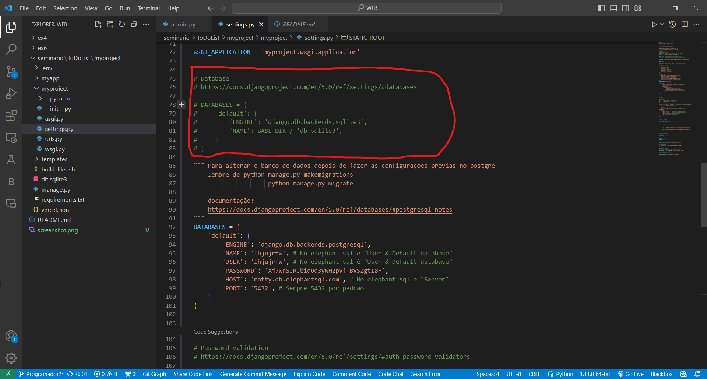

- após fazer a edição não esqueça de dar o comando
  
  ```python
   python manage.py migrate

Para atualizar o projeto com o novo banco de dados

# Como usar? (Modo usuário)
O usuário pode fazer o uso da aplicação clicando no link (https://web-wine-iota.vercel.app/). Logo na sequência o mesmo terá está visão da aplicação com a tela inicial de usuário.
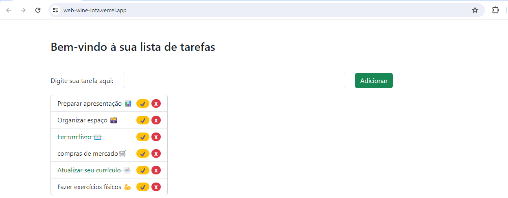
Na imagem acima, existe um campo de escrita logo no topo onde o usuário irá digitar o nome da sua tarefa e em seguida clicar no botão "ADICIONAR". Feito isso, a sua primeira tarefa estará gravada e a mesma aparecerá no topo da lista.


A nossa lista de tarefas aparece logo abaixo do campo de adição de novas tarefas, nele é possível ver as tarefas já registradas, concluidas e em aberto. (veja a imagem a seguir).


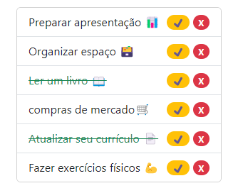


Com finalidade ilustrativa, existem na imagem tarefas em aberto e tarefas concluídas.
Como descrito no item anterior, cada nova tarefa adcionada aparecerá no topo da lista.
Assim que terminada a sua tarefa o usuário clica no botão amarelo, isso fara com que a sua tarefa seja riscada da lista e considerada como concluída.


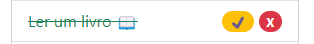


O icone vermelho com um x, indica que o usuário pode excluir aquela tarefa. Portanto, feito isso, ela será deletada permanentemente da sua lista.


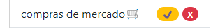


Para isso, não necessariamente a tarefa precisa estar concluída.


# Como usar? (Modo Administrador)


A imagem abaixo mostra como é a tela de um usuário administrador.


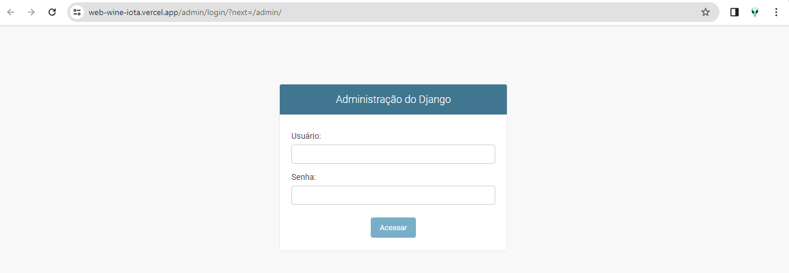


O administrador deverá fazer login usando seu nome de usuário e senha e em seguida clicar no botão "AVANÇAR".


Logo após ele verá a tela inicial de administrador:


No canto superior direito são disponibilizadas ao administrador os seguintes campos e funcionalidades:
- Campo de boas vindas com o nome do administrador;
- Campo para ir direto ao site;
  - Ao clicar, o administrador será encaminhado para a tela inicial da aplicação.
- Campo para alterar senha;
  - Ao clicar, será aberta a janela para alteração de senha (imagem abaixo).


  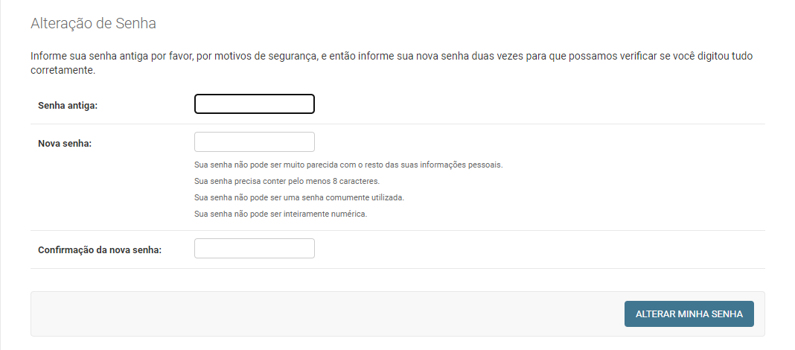


    - O sistema pedirá a senha antiga do usuário.
    - O campo de nova senha deverá ser preenchido seguindo as orientações impostas. No campo seguite pede-se que repita a nova senha a ser cadastrada.
    - POr fim o administrador clica no botão "ALTERAR MINHA SENHA". Sendo redirecionado para a pagina inicial de administrador.


- Campo para encerrar a sessão;
  - Ao clicar neste campo, o admin terá a sua frente a seguinte tela.


<<<<<<< HEAD
  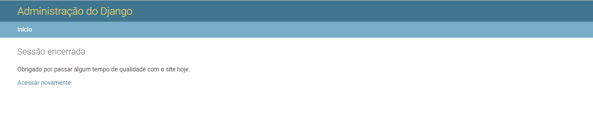
=======

# Como usar? (Modo usuário)
O usuário pode fazer o uso da aplicação clicando no link (https://web-wine-iota.vercel.app/). Logo na sequência o mesmo terá está visão da aplicação com a tela inicial de usuário.

Na imagem acima, existe um campo de escrita logo no topo onde o usuário irá digitar o nome da sua tarefa e em seguida clicar no botão "ADICIONAR". Feito isso, a sua primeira tarefa estará gravada e a mesma aparecerá no topo da lista.

A nossa lista de tarefas aparece logo abaixo do campo de adição de novas tarefas, nele é possível ver as tarefas já registradas, concluidas e em aberto. (veja a imagem a seguir).


Com finalidade ilustrativa, existem na imagem tarefas em aberto e tarefas concluídas. 
Como descrito no item anterior, cada nova tarefa adcionada aparecerá no topo da lista.
Assim que terminada a sua tarefa o usuário clica no botão amarelo, isso fara com que a sua tarefa seja riscada da lista e considerada como concluída.


O icone vermelho com um x, indica que o usuário pode excluir aquela tarefa. Portanto, feito isso, ela será deletada permanentemente da sua lista.


Para isso, não necessariamente a tarefa precisa estar concluída.

# Como usar? (Modo Administrador)

A imagem abaixo mostra como é a tela de um usuário administrador.


O administrador deverá fazer login usando seu nome de usuário e senha e em seguida clicar no botão "AVANÇAR". 

Logo após ele verá a tela inicial de administrador:


No canto superior direito são disponibilizadas ao administrador os seguintes campos e funcionalidades:
- Campo de boas vindas com o nome do administrador;
- Campo para ir direto ao site;
  - Ao clicar, o administrador será encaminhado para a tela inicial da aplicação.
- Campo para alterar senha;
  - Ao clicar, será aberta a janela para alteração de senha (imagem abaixo).

  

    - O sistema pedirá a senha antiga do usuário.
    - O campo de nova senha deverá ser preenchido seguindo as orientações impostas. No campo seguite pede-se que repita a nova senha a ser cadastrada. 
    - POr fim o administrador clica no botão "ALTERAR MINHA SENHA". Sendo redirecionado para a pagina inicial de administrador.

- Campo para encerrar a sessão;
  - Ao clicar neste campo, o admin terá a sua frente a seguinte tela.

  

- Abaixo, no canto direito da tela são exibidos os campos: 

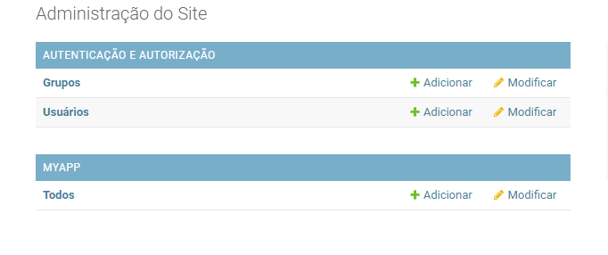

Aqui o user Admin pode executar as ações;

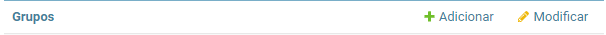

- Adicionar grupo permite que ele adcione um nome ao grupo e que dê permissões, essas permissões podem ser filtradas ou pesquisadas e salvar as informações quando inserir ou pesquisar.
A imagem a seguir descreve o campo "ADICIONAR".

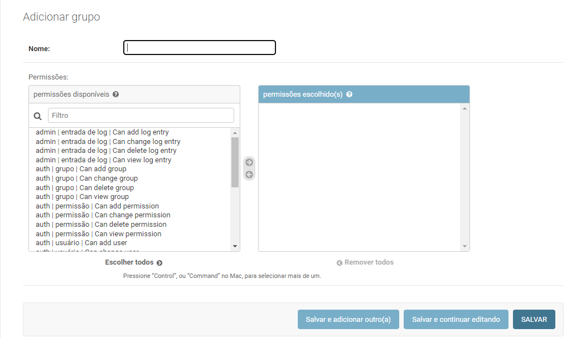

Voltando ao grupos, temos a opção "MODIFICAR". Está por sua vez permite que o Admin modifique grupos já existentes, podendo pesquisar entre eles, com descreve a imagem:

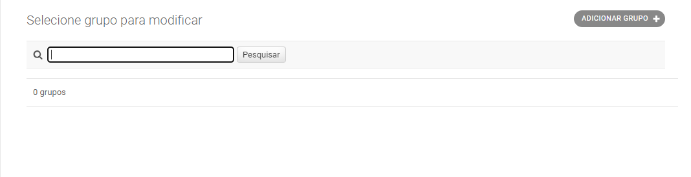

- Agora veremos quanto aos usuários.
Assim como em grupos, temos a opção de Adicionar e Modificar.

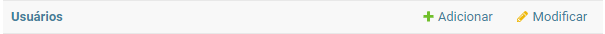

Clicando em "ADICIONAR" temos a seguinte tela:

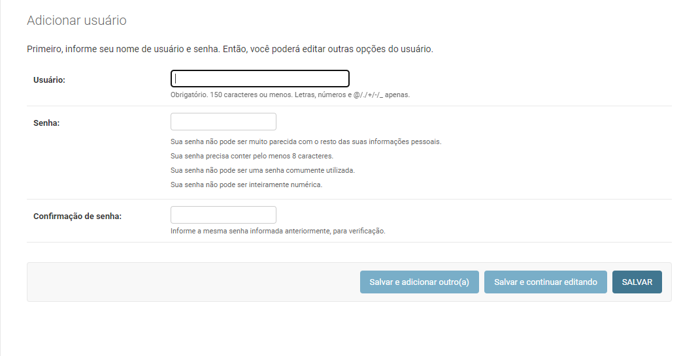

Aqui é possível criar um nome de usuario e senha para os usuarios e em seguida salvar as informações.

No campo "MODIFICAR" temos;

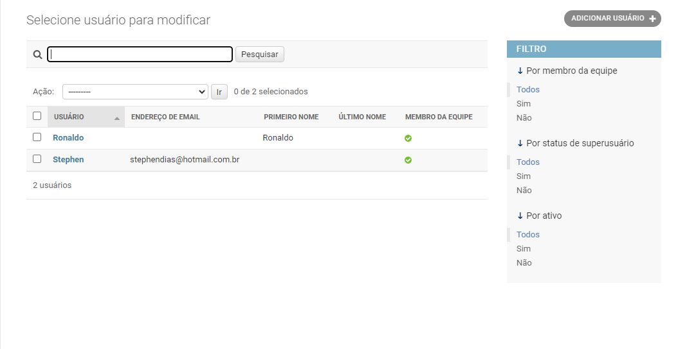

Nesta tela é possível ver todos os usuários cadastrados, selecioná-los e eventualmente excluí-los.

- Chegamos agora ao campo MYAPP. 

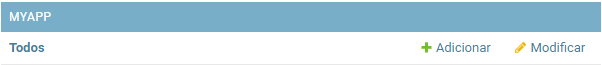

Como os dois campos anteriormente mencionados ele conta com os mesmos botões de ação, entretanto, esses possuem outras funcionalidades. 
Ao clicar em "ADICIONAR" temos;

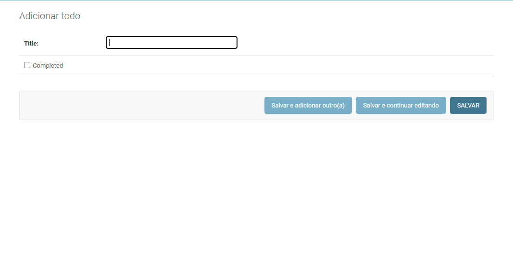

Aqui posso adiconar novas tarefas a lista e salvá-las.

Clicando em "MODIFICAR";

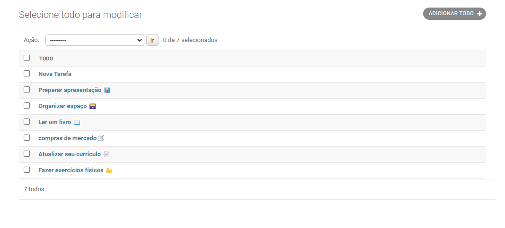

Aqui vemos as tarefas já adicionadas, tendo a possibilidade de selecionar e excluir.

- Por fim, na parte central da tela, temos o histórico de Ações recentes. Tudo que foi feito por meio das opções do administrador serão mostradas aqui.

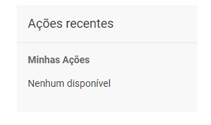

- Abaixo, no canto direito da tela são exibidos os campos:


Aqui o user Admin pode executar as ações;


- Adicionar grupo permite que ele adcione um nome ao grupo e que dê permissões, essas permissões podem ser filtradas ou pesquisadas e salvar as informações quando inserir ou pesquisar.
A imagem a seguir descreve o campo "ADICIONAR".


Voltando ao grupos, temos a opção "MODIFICAR". Está por sua vez permite que o Admin modifique grupos já existentes, podendo pesquisar entre eles, com descreve a imagem:


- Agora veremos quanto aos usuários.
Assim como em grupos, temos a opção de Adicionar e Modificar.


Clicando em "ADICIONAR" temos a seguinte tela:


Aqui é possível criar um nome de usuario e senha para os usuarios e em seguida salvar as informações.


No campo "MODIFICAR" temos;


Nesta tela é possível ver todos os usuários cadastrados, selecioná-los e eventualmente excluí-los.


- Chegamos agora ao campo MYAPP.


Como os dois campos anteriormente mencionados ele conta com os mesmos botões de ação, entretanto, esses possuem outras funcionalidades.
Ao clicar em "ADICIONAR" temos;


Aqui posso adiconar novas tarefas a lista e salvá-las.


Clicando em "MODIFICAR";


Aqui vemos as tarefas já adicionadas, tendo a possibilidade de selecionar e excluir.


- Por fim, na parte central da tela, temos o histórico de Ações recentes. Tudo que foi feito por meio das opções do administrador serão mostradas aqui.


## Contribuição
Contribuições são bem-vindas! Siga as diretrizes de contribuição do projeto.

## Licença
Este projeto está licenciado sob a Licença MIT. Consulte o arquivo LICENSE para obter detalhes.

##Contato
Se você tiver dúvidas ou precisar de ajuda, entre em contato conosco em stephendias@hotmail.com.br.

Referências
- Livro
  **Django de A a Z**.
  
Crie aplicações web rápidas, seguras e escaláveis com Python.

- https://www.casadocodigo.com.br/products/livro-django-a-z

- https://markdown.net.br/sintaxe-basica/
- https://medium.com/@devsumitg/simple-todo-list-app-in-django-framework-htmx-bootstrap-5-8b68cbd47a1a
- https://youtu.be/I5x8lAVQ8QQ?si=z2IKMTVuMOeAjH3d

  


